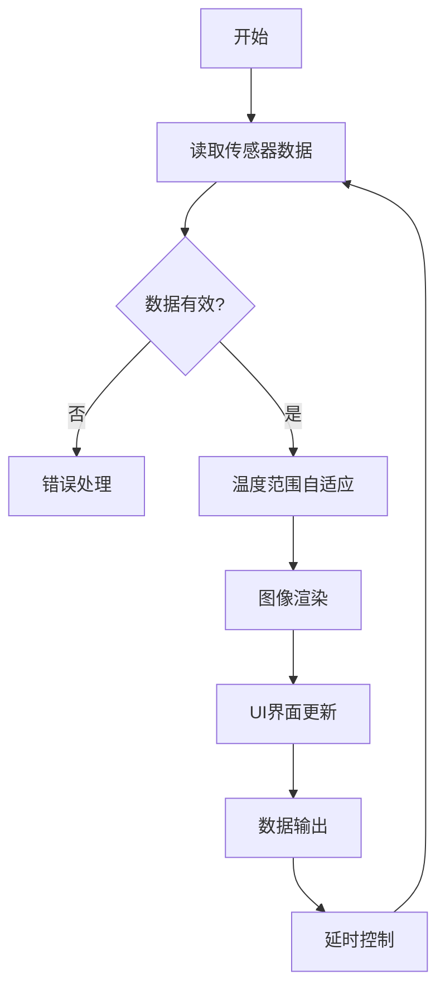

# ESP32 + MLX90640 热成像相机实现说明

## 项目概述

本项目实现了一个基于ESP32微控制器和MLX90640红外热成像传感器的便携式热成像相机系统。系统能够实时采集32×24像素的温度数据，并将其可视化为彩色热成像图像显示在TFT显示屏上。

## 硬件架构

### 核心组件
- **主控制器**: ESP32 WiFi/蓝牙微控制器
- **热成像传感器**: MLX90640-BAB (32×24像素红外阵列)
- **显示屏**: TFT彩色液晶屏 (如ILI9341)
- **通信接口**: I2C (传感器) + SPI (显示屏)

### 系统连接图
```
ESP32 (主控制器)
    │
    ├── I2C ─── MLX90640 (热成像传感器)
    │
    └── SPI ─── TFT显示屏 (图像输出)
```

## 软件架构

### 核心库依赖
```cpp
#include <Wire.h>          // I2C通信
#include <Adafruit_MLX90640.h> // MLX90640传感器驱动
#include <TFT_eSPI.h>      // ESP32 TFT显示屏驱动
```

### 主要模块组成

#### 1. 初始化模块
- **显示屏初始化**: 设置分辨率、方向、背景色
- **传感器初始化**: 检测MLX90640、配置工作模式
- **参数初始化**: 温度范围、颜色映射表

#### 2. 数据采集模块
- **温度数据读取**: 通过I2C获取32×24像素温度矩阵
- **数据验证**: 检查传感器通信状态
- **错误处理**: 通信失败时的重试机制

#### 3. 数据处理模块
- **温度范围自适应**: 动态调整显示温度范围
- **数据平滑滤波**: 减少温度跳动
- **归一化处理**: 将温度映射到0-1范围

#### 4. 图像渲染模块
- **颜色映射算法**: 温度值到RGB颜色的转换
- **像素放大显示**: 将32×24图像放大到屏幕分辨率
- **实时渲染**: 确保流畅的显示刷新率

#### 5. 用户界面模块
- **温度刻度条**: 显示当前温度范围参考
- **统计信息显示**: 实时温度统计数据
- **状态指示**: 系统运行状态反馈

## 核心算法详解

### 温度颜色映射算法
```cpp
uint16_t temperatureToColor(float temp) {
    // 1. 温度归一化: 将实际温度映射到0-1区间
    float normalized = (temp - minTemp) / (maxTemp - minTemp);
    normalized = constrain(normalized, 0.0, 1.0);
    
    // 2. 颜色索引计算: 根据归一化值选择颜色
    int colorIndex = (int)(normalized * (COLOR_COUNT - 1));
    colorIndex = constrain(colorIndex, 0, COLOR_COUNT - 1);
    
    // 3. 返回对应的RGB颜色值
    return thermalColors[colorIndex];
}
```

### 自适应温度范围算法
```cpp
void autoAdjustTemperatureRange() {
    float currentMin = 100.0, currentMax = -100.0;
    
    // 计算当前帧的极值温度
    for (int i = 0; i < 768; i++) { // 32×24=768
        float temp = mlx90640Frame[i];
        currentMin = min(currentMin, temp);
        currentMax = max(currentMax, temp);
    }
    
    // 平滑过渡: 避免温度范围突变
    minTemp = minTemp * 0.95 + currentMin * 0.05;
    maxTemp = maxTemp * 0.95 + currentMax * 0.05;
    
    // 保证最小温差: 确保颜色映射有效性
    if (maxTemp - minTemp < 5.0) {
        maxTemp = minTemp + 5.0;
    }
}
```

## 数据处理流程

### 主循环执行序列


### 实时数据显示流程
1. **数据采集**: I2C读取768个温度点(32×24)
2. **预处理**: 数据有效性验证和错误处理
3. **统计分析**: 计算最大/最小/平均温度
4. **范围调整**: 自适应调整显示温度范围
5. **颜色转换**: 温度值映射到颜色空间
6. **图像渲染**: 绘制放大后的热成像图像
7. **界面更新**: 刷新刻度条和统计信息

## 性能优化策略

### 1. 显示优化
- **像素块渲染**: 将小分辨率图像放大显示，减少绘制调用次数
- **局部刷新**: 只更新变化区域，减少全屏刷新

### 2. 数据处理优化
- **平滑滤波**: 使用加权平均减少温度跳动
- **范围缓存**: 避免每帧重新计算温度范围

### 3. 内存优化
- **静态分配**: 预先分配帧缓冲区，避免动态内存分配
- **复用缓冲区**: 重复使用图像渲染缓冲区

## 关键参数配置

### 传感器配置参数
```cpp
// MLX90640工作模式设置
mlx.setMode(MLX90640_INTERLEAVED);    // 交织模式
mlx.setResolution(MLX90640_ADC_18BIT);// 18位ADC分辨率
mlx.setRefreshRate(MLX90640_8_HZ);    // 8Hz刷新率
```

### 显示参数配置
```cpp
// 温度显示范围
float minTemp = 20.0;  // 最低显示温度(℃)
float maxTemp = 40.0;  // 最高显示温度(℃)

// 颜色映射表(8色渐变)
uint16_t thermalColors[8] = {
    TFT_BLUE, TFT_DARKCYAN, TFT_CYAN, TFT_GREEN,
    TFT_GREENYELLOW, TFT_YELLOW, TFT_ORANGE, TFT_RED
};
```

## 扩展功能建议

### 1. 数据记录功能
- 添加SD卡模块存储温度数据
- 实现时间序列温度记录

### 2. 网络传输功能
- 利用ESP32 WiFi功能上传数据到云端
- 实现远程监控和手机APP查看

### 3. 高级图像处理
- 温度异常区域自动识别
- 多点温度监测和报警功能

### 4. 用户交互增强
- 添加按键控制温度范围手动调整
- 实现多种颜色模式切换

## 故障排除指南

### 常见问题及解决方案
1. **传感器未检测到**: 检查I2C接线和地址配置
2. **显示异常**: 验证SPI引脚定义和显示屏初始化
3. **温度数据不稳定**: 调整刷新率或添加数据滤波
4. **性能问题**: 优化渲染算法或降低显示分辨率

## 技术规格汇总

| 参数 | 规格 |
|------|------|
| 温度分辨率 | 32×24像素 (768点) |
| 温度范围 | -40°C ~ 300°C (可调显示范围) |
| 刷新率 | 可达8Hz |
| 显示输出 | 彩色TFT液晶屏 |
| 功耗 | ESP32 + MLX90640 ≈ 200mA @ 3.3V |
| 通信接口 | I2C (传感器) + SPI (显示屏) |

这个实现提供了一个完整的热成像相机解决方案，具有良好的实时性和可扩展性，适合各种温度监测应用场景。
